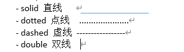
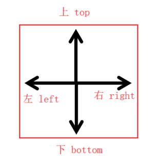
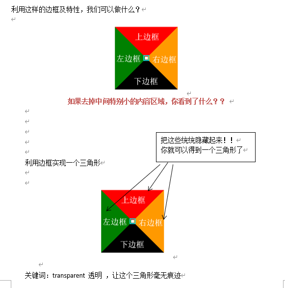
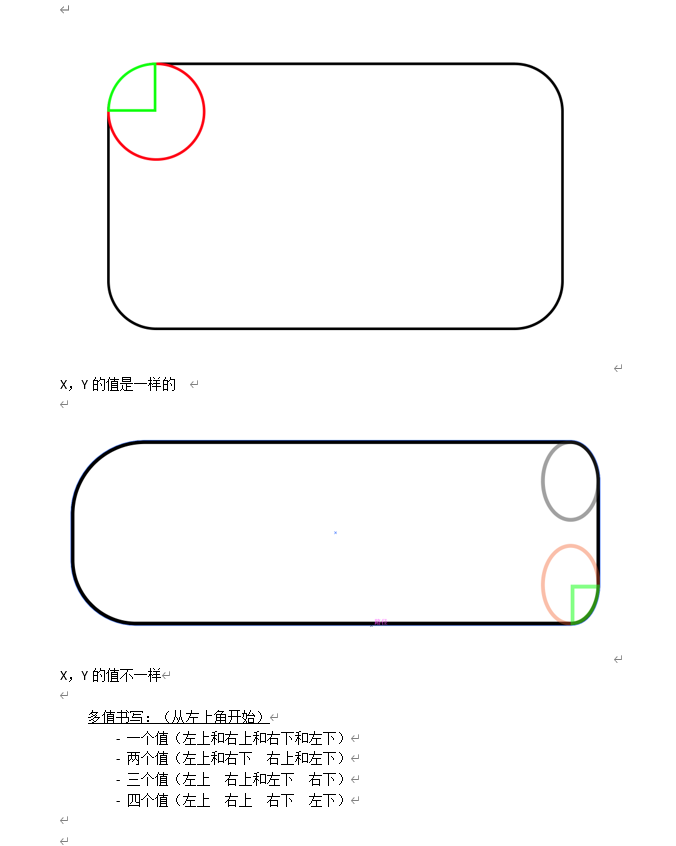

# border
## border 边框
（一个边框的设置，需要设置边框的宽度、颜色、边框的样式）
border-width 边框宽度（单位：px）

## border-color 边框颜色
（三种形式）
- 关键词（英文颜色单词，例如：red）
- RGB（三原色，利用ps工具获取这些数值 CMYK）
- RGBa ( alpha 不透明度 )
- 十六进制颜色（0123456789abcdef）

## border-style 边框样式
- （三种形式）
- 

- 多值书写： 上右下左  顺时针
- 一个值（上右下左）
- 两个值（上下 和 左右）
- 三个值（上 和 左右 和 下）
- 四个值（上 和 左 和 下 和 右）

## 复合样式：
- 语法糖 border: width style color; 顺序无所谓

## 思考
###  border-left：左边框
边框宽度 边框样式 边框颜色;
- border-left-width:左边框宽度;
- border-left-color:左边框颜色;
- border-left-style:左边框样式;

### border-right 右边框
- border-right-width
- border-right-color
- border-right-style

### border-top 上边框
- border-top-width
- border-top-color
- border-top-style

## - border-bottom下边框

层叠样式表：
- 在样式表中，给同一个元素 添加 同一条样式，后面覆盖前面的

边框的特性：
- 同一个元素，相交的两条边框，连接处是斜线
- 元素的宽高 = width + 边框 \  height  + 边框

## 扩展

rgba(red,green,blue,alpha)  a - 控制透明度，取0 - 1的值，
表示0%~100%小数点前面的0可以省略，例如：0.5  ->  .5

小三角的应用：
- [示例一](https://www.163.com/)   
- [示例二](http://www.uedna.com/)

## 画完方，想画圆？ 
十八般武艺之- 左手画方右手画圆
### border-radius：半径;  用于设置圆角（IE9之前不支持）
半径（x/y）：
- 具体数值，单位px
- 百分比，单位 %

## 总结
- width: 100px;  宽度； 单位 px  pixel（理解成发光二极管）
- height: 200px; 高度；单位
- Border-width  边框的宽度  上 右  下  左
- border-style   边框的样式
- border-color  边框的颜色
- border复合样式 ： 上 右  下  左
- Border-radius：10px;  
- 半径， X, Y 轴 ， 复合样式
