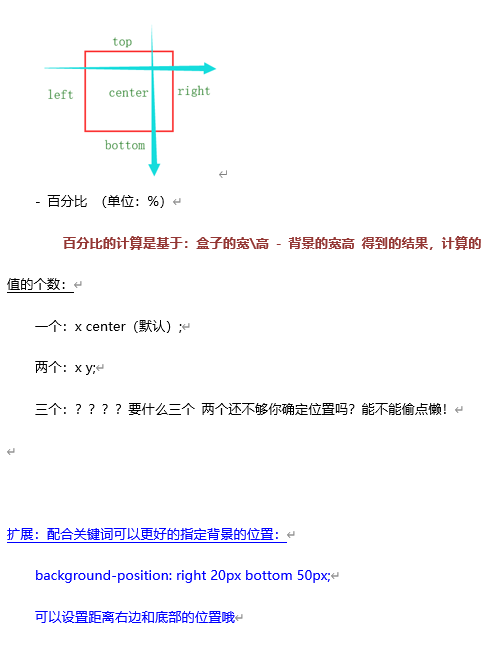
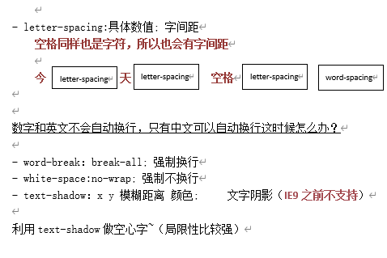

# 常用样式
## 1.  background 背景颜色
### background 背景
- background-color：颜色; （三种形式颜色值：关键词、rgb、十六进制颜色值）
- background-image：url(背景图片地址);
### 路径问题：
- 无论从哪里出发，通过这个地址都能找到目标：绝对路径
- 你往前走一百米，然后左转再走两百米就到了：相对路径 
- 知道什么是路径了，哪种路径会比较好？一般用相对路径  为什么？？
当你的文件地址一发生变化，获取外部资源的时候，你就会发现.......资源路径不对了！！！然后你就获取不到了，然后网站就凉凉了。
但是相对路径不一样，是基于当前的位置，去找另一个文件，只要这两个文件之间的关系不发生变化，就永远不会出现上面的问题。但是如果资源过多，需要有专门的资源服务器，这时候为了资源响应优化，推荐使用绝对地址。
### 那我们应该如何基于当前的位置，找另一个文件？

- 如果在上一层文件夹 ../
- 如果在上上层文件夹 ../../
- 如果在上上上层文件夹../../../
- ....以此类推
- 如果是在同级的文件夹里面呢？
先进入文件夹，再找具体文件：文件夹名/文件名
-如果是同级呢的文件呢？
那还不简单，直接写上文件名字！！

- background-repeat: repeat\repeat-x\repeat-y\no-repeat;背景重复
- background-position:位置;背景定位 控制背景的位置
### 值的类型：
- 具体数值 （单位：px）
- 关键词 ：right、left、top、bottom、center

### background-attachment：
- fixed\scroll;背景滚动
-背景是跟随滚动条滚动（scroll），还是固定当前位置（fixed）
** 这个值会影响到背景定位，从基于当前元素，变成基于可视区

### 复合样式：
- background:背景颜色 背景图 背景重复 背景定位 背景跟随滚动;

## 2.  font 字体设置
- font-weight:bold; 字体加粗
- font-style:italic;字体样式 倾斜
- font-weight \ font-style 如果想要去除的话，可以使用normal
- font-size：数值px; 字体大小
谷歌最小显示字体为12px，小于12px的，都按照12px处理
不设置的情况，一般默认为16px的大小
解决方案：截图，作为图片显示

- font-family：字体样式名字; 字体
中文常用：微软雅黑、宋体、苹方 （中文必须写在引号内）
英文常用：Arial、Helvetica
首选字体放在前面，备选字体放在后面
英文写在中文的前面，因为英文的字体里面没有中文的，但是因为中文有aoe拼音，所以对于英文也有字体的设计。
工作中一定要注意：英文和中文都选中看一下，字体是否一致

### 扩展：@font-face：
自定义字体，字体图标，iconfont

- line-height:具体数值; 行高;
- 具体数值 px
- 倍数：该倍数是根据字体大小来进行计算的
行高的测量（看操作！！）
- 单行中文的测量

### 文本设置
- color：颜色; 文字颜色（三种方式:关键词、rgb、十六进制颜色）;
- text-align: left \ right \ center; 文本对齐方式

### 扩展：文字两端对齐：
- text-align:justify
-text-align-last: justify

### text-indent:具体数值; 首行缩进
单位：em -> 1em = 当前设置的这个元素上的文字大小，想缩进两个文字?
2em就好啦 搜 easy~

- text-decoration:修饰值; 文本修饰;
- none; 去除
- underline 下划线
- overline 上划线
- line-through 删除线（不要(5980)这个数字上有条线，不要只要1980！）

- word-spacing：具体数值; 词间距
浏览器怎么知道什么是单词？你要自己用空格间隔开来，这时候才有效果
- 间隔 = 空格大小+词间距
- 在宋体的情况下，一个空格 =  字体大小的一半，但是不是所有字体都是

## 3. 文本设置

- color：颜色; 文字颜色（三种方式:关键词、rgb、十六进制颜色）;
- text-align: left \ right \ center; 文本对齐方式

### 扩展：文字两端对齐：
- text-align:justify
-text-align-last: justify

### text-indent:具体数值; 首行缩进
单位：em -> 1em = 当前设置的这个元素上的文字大小，想缩进两个文字?
2em就好啦 搜 easy~

- text-decoration:修饰值; 文本修饰;
- none; 去除
- underline 下划线
- overline 上划线
- line-through 删除线（不要(5980)这个数字上有条线，不要只要1980！）

- word-spacing：具体数值; 词间距
浏览器怎么知道什么是单词？你要自己用空格间隔开来，这时候才有效果
- 间隔 = 空格大小+词间距
- 在宋体的情况下，一个空格 =  字体大小的一半，但是不是所有字体都是

